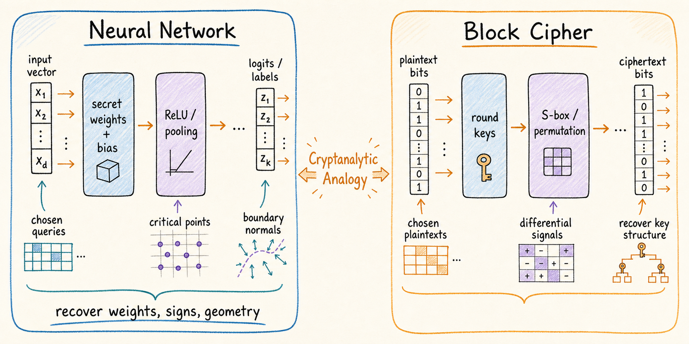

  

# Awesome Cryptanalytic Model Extraction

A curated list of papers, code, taxonomies, and open problems on **cryptanalytic neural-network model extraction**.

This repository focuses on extraction attacks that try to recover parameters, signatures, signs, decision-boundary geometry, or functionally equivalent models from oracle access. This is different from ordinary model stealing, which often only trains a surrogate with high test-set fidelity.

[中文版](README_zh-CN.md)

## Scope

Cryptanalytic model extraction treats a neural network as a cryptographic object:

- the model parameters are the secret key;
- queries are chosen inputs;
- labels, probabilities, or logits are oracle outputs;
- critical points, transition points, dual points, and boundary normals are the leakage signals;
- extraction aims to recover hidden structure, not merely imitate the model on natural data.

This list mainly covers:

- ReLU and piecewise-linear neural networks;
- raw-output, soft-label, and hard-label oracles;
- MLP, CNN, RNN, GNN, PReLU, non-linear activation, max-pooling, and PPML settings;
- cryptanalytic attacks, reproducibility code, limitations, and defenses.

It does not aim to be a complete list of all black-box model stealing papers.

## Reading Roadmap

If you are new to this area, read in this order.

1. **Raw-output extraction for ReLU MLPs**
   - Start with Carlini, Jagielski, and Mironov's CRYPTO 2020 paper.
   - Then read the polynomial-time improvements from EUROCRYPT 2024.

2. **Hard-label extraction**
   - Read the early hard-label formulation.
   - Then read the dual-point and boundary-geometry based hard-label extraction line.
   - Follow with algebraic hard-label extraction, which targets the SVD-heavy dual-point clustering bottleneck.
   - Finally read follow-up papers on output-layer recovery, persistent/dead neurons, and polynomiality limitations.

3. **CNN extraction**
   - Read the average-pooling CNN extraction work.
   - Then read max-pooling extraction papers.
   - Pay attention to whether the oracle is hard-label, soft-label, or raw-logit.

4. **Activation and architecture extensions**
   - PReLU, LeakyReLU, HardTanh, Step, and other activation functions.
   - RNN and GNN extraction.
   - PPML and side-channel assisted extraction.

5. **Open problems and defenses**
   - Train-time defenses such as neuron-similarity regularization.
   - Output rounding and adapted attacks against rounded oracles.
   - Hard-label CNN with max-pooling.
   - Unknown or weak architecture knowledge.
   - Event observability under top-1 labels.
   - Defenses against full-domain geometric extraction.

## Core Analogy and Taxonomy

The central analogy is that neural networks and block ciphers both alternate between secret linear transformations and public nonlinear operations. In block ciphers, the secret material is the round key; in neural networks, it is the learned weights and biases. Cryptanalytic extraction attacks exploit this structure by querying the model and recovering hidden geometric or algebraic information.

Cryptanalytic extraction papers can be organized along four axes:

| Axis | Typical values |
|---|---|
| Oracle | Hard label, soft label, top-k scores, probabilities, raw logits |
| Signal | Critical points, transition points, dual points, boundary normals, side-channel leakage |
| Target | Neuron signatures, signs, layer parameters, functional equivalence, geometric substitutes |
| Architecture | MLP, CNN, RNN, GNN, PReLU/non-ReLU networks, PPML/deployed systems |

## Code Status Legend

| Label | Meaning |
|---|---|
| Official | Code released by the paper authors. |
| Unofficial | Third-party implementation or reproduction. |
| Mirror | Fork or mirror for archival convenience. |
| Gone | The paper links code, but the link is no longer reachable. |
| Announced | The paper says code will be released, but no usable URL is available. |
| Not found | No public source-code URL found. |

## Paper List

Papers are grouped by primary research line. Inside each group, entries are ordered by year.

### Raw-Output ReLU MLP Extraction

| Year | Paper | Archive / venue | Oracle | Architecture | Main idea | Code |
|---|---|---|---|---|---|---|
| 2020 | [Cryptanalytic Extraction of Neural Network Models](https://arxiv.org/abs/2003.04884) | CRYPTO 2020 / arXiv | Raw logits | ReLU MLP | Critical-point based differential extraction | [Official](https://github.com/google-research/cryptanalytic-model-extraction) |
| 2023 | [Polynomial Time Cryptanalytic Extraction of Neural Network Models](https://eprint.iacr.org/2023/1526) | ePrint 2023/1526 / EUROCRYPT 2024 line | Raw logits | ReLU MLP | Polynomial-time sign recovery and extraction improvements | [Official](https://github.com/Crypto-TII/deti) |
| 2026 | [Geometric Critical Point Screening: Clustering-Free Cryptanalytic Extraction of Neural Network Models](https://eprint.iacr.org/2026/1025) | ePrint 2026/1025 | Raw logits | ReLU networks | Geometric screening of useful critical points | [Official](https://github.com/1983321048/Geometric-CriticalPoint-Screening) |
| 2026 | [Navigating the Deep End: End-to-End Extraction on Deep Neural Networks](https://eprint.iacr.org/2026/296) | ePrint 2026/296 | Raw logits | Deep ReLU MLP | End-to-end extraction beyond early layers | [Official](https://github.com/PsyduckLiu/End-to-End-Deep-Neural-Network-Extraction) |

### Hard-Label ReLU MLP Extraction

| Year | Paper | Archive / venue | Oracle | Architecture | Main idea | Code |
|---|---|---|---|---|---|---|
| 2024 | [Hard-Label Cryptanalytic Extraction of Neural Network Models](https://eprint.iacr.org/2024/1403) | ePrint 2024/1403 | Hard label | ReLU MLP | Functionally equivalent extraction from label-only access | [Official](https://github.com/AI-Lab-Y/NN_cryptanalytic_extraction) |
| 2024 | [Polynomial Time Cryptanalytic Extraction of Deep Neural Networks in the Hard-Label Setting](https://eprint.iacr.org/2024/1580) | ePrint 2024/1580 / EUROCRYPT 2025 line | Hard label | Deep ReLU MLP | Transition points, dual points, signature and sign recovery | [Official](https://github.com/Jchavezsaab/hard-label-dnn-extraction) |
| 2025 | [Extracting Some Layers of Deep Neural Networks in the Hard-Label Setting](https://eprint.iacr.org/2025/1118) | ePrint 2025/1118 | Hard label | ReLU MLP | Output-layer and partial-layer extraction under structural conditions | [Official](https://github.com/deividafonso281/hard-label-contract-output), [Related](https://github.com/Jchavezsaab/hard-label-dnn-extraction) |
| 2025 | [Is the Hard-Label Cryptanalytic Model Extraction Really Polynomial?](https://eprint.iacr.org/2025/1868) | ePrint 2025/1868 | Hard label | ReLU MLP | Persistent/dead neuron limitations and polynomiality critique | Not found |
| 2026 | [Algebraic Cryptanalytic Extraction on Hard-Label Neural Networks](https://eprint.iacr.org/2026/1164) | ePrint 2026/1164 | Hard label | ReLU neural networks | Algebraic reformulation of hard-label extraction that avoids SVD-heavy dual-point clustering | Not found |

### CNN and Pooling Extraction

| Year | Paper | Archive / venue | Oracle | Architecture | Main idea | Code |
|---|---|---|---|---|---|---|
| 2026 | [Cryptanalytic Extraction of Convolutional Neural Networks](https://eprint.iacr.org/2026/139) | ePrint 2026/139 | Hard label | CNN with average pooling | CNN extraction via convolutional structure and kernel recovery | Gone: anonymous 4open link returns 410 |
| 2026 | [Algebraic Attack on Convolutional Neural Network with Max Pooling](https://eprint.iacr.org/2026/241) | ePrint 2026/241 | Raw / soft-output line | CNN with max pooling | PSP/RPCP style max-pooling extraction | Announced, no URL |
| 2026 | [Model Extraction of Convolutional Neural Networks with Max-Pooling](https://eprint.iacr.org/2026/464) | ePrint 2026/464 | Raw / soft-output line | CNN with max pooling | Max-pooling CNN extraction and receptive-field structure | Not found |
| 2026 | [End-to-End Polynomial-Time Cryptanalytic Extraction of Convolutional Neural Networks in the Hard-Label Setting](https://eprint.iacr.org/2026/902) | ePrint 2026/902 | Hard label | CNN with average pooling | End-to-end hard-label CNN extraction | Announced, no URL found |

### Activation Function Extensions

| Year | Paper | Archive / venue | Oracle | Architecture | Main idea | Code |
|---|---|---|---|---|---|---|
| 2025 | [Delving into Cryptanalytic Extraction of PReLU Neural Networks](https://eprint.iacr.org/2025/1970) | ePrint 2025/1970 | Raw / hard-label line | PReLU networks | PReLU-specific extraction and limitations | [Official](https://github.com/AI-Lab-Y/Extracting_PReLU_NN) |
| 2026 | [Breaking Slope and Structure Restrictions: Broadening Hard-Label Cryptanalytic Extraction of PReLU Neural Networks](https://eprint.iacr.org/2026/1066) | ePrint 2026/1066 | Hard label | PReLU networks | Removes slope and structure restrictions in PReLU extraction | Not found |
| 2026 | [Cryptanalytic Extraction of Neural Networks with Various Activation Functions](https://eprint.iacr.org/2026/178) | ePrint 2026/178 | Raw / hard-label line | Various activations | Extraction beyond standard ReLU | [Official](https://github.com/qixiaokang1-stack/cryptanalytic-model-various-functions) |
| 2026 | [Cryptanalytic Extraction of Deep Neural Networks with Non-Linear Activations](https://eprint.iacr.org/2026/253) | ePrint 2026/253 | Raw-output line | Non-linear activations | Extraction with pseudo-normal and non-linear activation handling | [Official](https://github.com/mstealercryptocrypto-ops/mod_stealer26) |

### Other Architectures and Deployment Settings

| Year | Paper | Archive / venue | Oracle | Architecture | Main idea | Code |
|---|---|---|---|---|---|---|
| 2024 | [A Hard-Label Cryptanalytic Extraction of Non-Fully Connected Deep Neural Networks using Side-Channel Attacks](https://eprint.iacr.org/2024/1870) | ePrint 2024/1870 | Hard label + side channel | Non-FC DNN / CNN-like models | Side-channel assisted extraction of non-FC components | [Official](https://github.com/bcoqueret/Side_channel_cryptanalytic_extraction_of_DNN) |
| 2026 | [Cryptanalytic Extraction of Recurrent Neural Network Models](https://eprint.iacr.org/2026/168) | ePrint 2026/168 | Raw / hard-label line | RNN | Extends cryptanalytic extraction to recurrent models | Not found |
| 2026 | [Polynomial-Time Cryptanalytic Extraction of Graph Neural Networks in the Hard-Label Setting](https://eprint.iacr.org/2026/719) | ePrint 2026/719 | Hard label | GNN | Message-passing and graph-structure extraction | [Official](https://github.com/springli07/GNN_MP_CEA) |
| 2026 | [PPML Is More Vulnerable to Cryptanalytic Extraction Attacks](https://eprint.iacr.org/2026/848) | ePrint 2026/848 | PPML setting | Protected inference systems | Extraction risks in privacy-preserving ML deployments | Not found |

### Defenses and Defense Evaluations

| Year | Paper | Archive / venue | Oracle | Architecture | Main idea | Code |
|---|---|---|---|---|---|---|
| 2025 | [Train to Defend: First Defense Against Cryptanalytic Neural Network Parameter Extraction Attacks](https://arxiv.org/abs/2509.16546) | NeurIPS 2025 / arXiv | Defense against cryptanalytic extraction | ReLU MLP | Extraction-aware training that reduces neuron uniqueness via weight-similarity regularization | [Official](https://github.com/anonymous-123-code/anonymouscode) |
| 2026 | [Output Rounding Is Not a Free Defense Against Cryptanalytic Neural Network Extraction](https://65610.csail.mit.edu/2026/reports/cryptanalytic_nn_extract.pdf) | MIT 6.5610 Spring 2026 report | Rounded raw output | ReLU MLP | Studies output rounding as a defense and introduces a step-spacing attack against rounded oracles | Not found |

## By Oracle Model

### Raw logits

Raw-logit attacks are closest to the original CRYPTO 2020 setting. They can detect derivative discontinuities directly and often recover neuron signatures from critical points.

Representative papers:

- CRYPTO 2020 cryptanalytic extraction.
- Polynomial-time raw-output extraction.
- Deep end-to-end extraction.
- CNN and max-pooling extraction in raw/soft-output settings.

### Hard label

Hard-label attacks only observe the top-1 class. They must infer useful geometry from decision boundaries, transition points, and dual points.

Representative papers:

- Hard-label cryptanalytic extraction.
- Polynomial-time hard-label deep extraction.
- Algebraic hard-label extraction.
- Partial/output-layer hard-label extraction.
- Hard-label CNN and GNN extraction.

### Soft labels and probabilities

Soft-label settings sit between hard-label and raw-logit extraction. They leak more than top-1 labels but less than exact pre-softmax logits.

Important question:

- Which critical or pooling events remain observable after softmax or top-k truncation?

### Defenses and mitigations

Defenses are still sparse compared with attacks. The current line includes training-time defenses that reduce neuron uniqueness and output-side defenses such as rounding. The key lesson from the rounding report is that a defense that breaks the original finite-difference primitive may still be vulnerable to an adapted attack that treats the modified oracle as part of the threat model.

Representative works:

- Train to Defend.
- Output rounding and step-spacing extraction.
- Full-domain geometry masking and event-purity defenses remain open.

## By Architecture

| Architecture | Status | Representative papers |
|---|---|---|
| ReLU MLP | Most mature | CRYPTO 2020, EUROCRYPT 2024, hard-label deep extraction |
| Deep MLP | Active | End-to-end extraction, algebraic hard-label extraction, persistent/dead neuron analysis |
| CNN with average pooling | Emerging | CNN extraction, end-to-end hard-label CNN extraction |
| CNN with max pooling | Open and difficult | Algebraic max-pooling attack, max-pooling extraction |
| PReLU / non-ReLU activations | Active | PReLU extraction, various activation functions, non-linear activations |
| RNN | Early | RNN extraction |
| GNN | Emerging | Hard-label GNN extraction |
| PPML / deployed systems | Early | PPML vulnerability, side-channel extraction |

## Open Problems

### 1. Hard-label CNNs with max-pooling

Hard-label CNN extraction is strongest for average pooling. Max-pooling extraction has stronger results under raw or soft outputs. Under top-1 labels, PSP/RPCP observability, winner-pattern localization, and event purity remain difficult.

Useful questions:

- Are max-pooling switch points observable from top-1 labels alone?
- Can boundary-walking isolate pooling events without raw logits?
- Is there an event-observability barrier for hard-label max-pooling?

### 2. Unknown architecture or weak architecture knowledge

Most strong extraction results assume the architecture is known. A more realistic API threat model should infer architecture before parameter extraction.

Useful questions:

- Can layer type, width, kernel size, stride, and pooling type be inferred from boundary geometry?
- Can architecture recovery be connected to cryptanalytic extraction pipelines?
- What is the minimum architecture knowledge needed for each attack?

### 3. Event purity and false critical points

Modern extraction attacks often depend on collecting clean critical, transition, or dual points. Spurious events can destroy clustering or sign recovery.

Useful questions:

- How robust are extraction pipelines to artificial or naturally occurring event pollution?
- Can event purity be measured independently of full extraction success?
- Can defenses target event purity without degrading clean accuracy?

### 4. Defenses against full-domain geometric extraction

A model's behavior on the data manifold does not uniquely determine its full-domain piecewise-linear extension. Cryptanalytic extraction often relies on that extension.

Useful questions:

- Can a defender preserve clean behavior while masking off-manifold geometry?
- Can dormant chaff neurons or normal-jet masking amplify extraction cost?
- How should we evaluate the difference between behavioral fidelity and geometric utility?
- How should train-time defenses such as neuron-similarity regularization be combined with deployment-time defenses?
- Can output rounding be made robust against adapted step-spacing attacks without unacceptable utility loss?

### 5. Realistic APIs

Many papers use idealized or high-precision oracle assumptions.

Useful questions:

- What happens under rate limits, quantized outputs, randomized preprocessing, batching, or abstention?
- Which attacks survive common commercial API constraints?
- Can extraction still recover useful white-box substitutes under realistic noise?

## Recommended Repository Policy

This repository should link official code rather than vendoring all source code.

Reasons:

- licenses differ across projects;
- direct vendoring makes the repository too large;
- upstream repositories may update;
- paper lists are easier to maintain when they remain lightweight.

Recommended policy:

- link the official source repository when available;
- optionally fork important repositories for archival purposes;
- mark forks as mirrors, not original code;
- do not use submodules unless this repository becomes a reproducibility benchmark.

## Contributing

Contributions are welcome.

Please include:

- paper title;
- year and venue/archive;
- paper URL;
- oracle model;
- target architecture;
- extraction target;
- main technical idea;
- code URL and whether it is official;
- a short note on assumptions or limitations.

For code links, prefer official repositories. If the link is dead, mark it as `Gone` and include the last known URL.

## BibTeX

BibTeX entries will be added in `bib/cryptanalytic_extraction.bib`.

## Disclaimer

This repository is for academic research and defensive analysis. The goal is to understand model-extraction risks, assumptions, reproducibility, and defenses.
